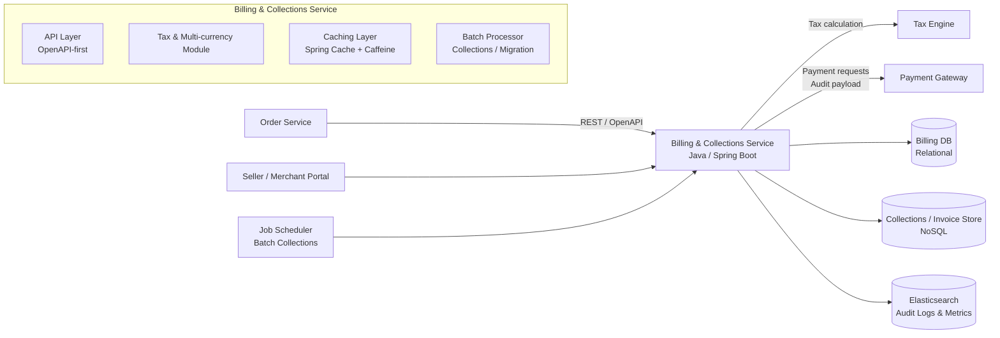
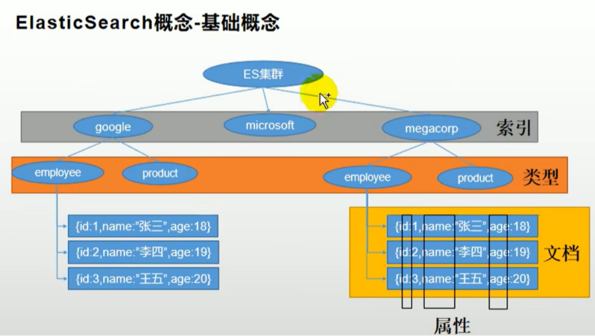

查的GPT链接，包含下面所有：https://chatgpt.com/share/6932a78f-a6e4-8004-9980-93f26d11c2e3

------

## 1. Short introduction（1 分钟自我项目介绍）

> **You:**
>  Sure. In my current role I work on the billing and payments platform for Shein’s global marketplace.
>  Our team owns the backend services that calculate taxes, handle multi-currency charges, and support collections and payment reconciliation.
>
> On the backend side I mainly use Java and Spring Boot. I helped design the domain model for amounts and tax bases, extended the billing schema for reporting, and led the migration of one legacy billing microservice to Spring Boot 3 and Jakarta EE 9+.
>
> I also integrated Elasticsearch-based audit logging and added caching and batch operations on top of our NoSQL store, so that fee processing and collections are both observable and scalable for tens of millions of monthly transactions.

- **OpenAPI** 

  就是用一份 YAML/JSON 文件，把你的 REST API“标准化地写清楚”——路径、参数、请求体、响应、错误码、鉴权……都写在里面。
  写好这份“API 说明书”之后，可以：

  自动生成 Swagger UI 这样的交互式文档

  生成前后端 SDK / server stub 代码

  让测试、网关、Mock 服务都围绕一个统一的“契约”来工作

  ## 常问问题：
  
  1. **Spring Boot 2 → 3 迁移踩了什么坑？**
  
  → javax → jakarta 命名空间变了；Spring Security 配置 API 全变（SecurityFilterChain Bean 替代 WebSecurityConfigurerAdapter）；JPA 也改了
  
  2. **多币种归一化怎么做的？汇率从哪来？**
  
  → 统一以美元为基准存，汇率从外部 service 拉取并 Redis 缓存；金额一律 BigDecimal 不用 double
  
  3. **Elasticsearch 怎么用于审计日志？ / 为什么不用关系数据库？**
  
  → 写多读多场景下的全文检索、聚合分析、ES 的倒排索引适合大量日志查询
  
  4. **OpenAPI-first 是什么？ / 怎么保持 schema 跨服务一致？**
  
  → 先写 OpenAPI 规范（YAML），用 codegen 生成 Java 接口；schema 版本化（v1/v2/...）
  
  5. **批量 50K-100K 记录怎么处理？ / 失败的怎么处理？**
  
   → Spring Batch 或自己写分块 + 线程池；失败的写到 error log，最后输出成功/失败报告
  
  6. **为什么用 Redis 加速 billing history 查询？TTL 怎么设？** 
  
  → 高频读取场景，TTL 根据数据更新频率（典型 5-30 分钟）

------

## 2. Upstream / Downstream 如何交互

你可以把自己这个 Billing & Collections Service 当成「中间层」：

- **Upstream（上游）**：订单系统 / 商家平台 / 支付触发服务
- **Downstream（下游）**：支付网关、税务引擎、NoSQL 存储、Elasticsearch、数仓/报表

### 回答模版

> **You:**
>  At a high level, our billing service sits in the middle of the marketplace stack.
>
> **Upstream**, we mainly talk to:
>
> - the order and listing services, which send us charge creation or adjustment requests, and
> - some internal job schedulers that trigger collections or invoice migration batches.
>    These are mostly internal REST calls using our OpenAPI contracts.
>
> **Downstream**, we integrate with:
>
> - a tax engine, which we call to compute tax amounts based on the tax base and jurisdiction;
> - a payment gateway layer, where we send payment or payout requests and log the exact payloads into our audit store;
> - our primary billing and collections stores (a relational store for core billing data and a NoSQL store for collections details); and
> - Elasticsearch, where we send structured audit events and business metrics.
>
> So on each request, the billing service will validate the input from upstream, normalize the amounts and taxes, persist the billing records, and then either call downstream services synchronously or enqueue a background job, and finally emit structured logs into Elasticsearch for observability.

**中文理解版：**

- 上游：
  - Order / Listing Service 调你：创建或调整 charge
  - Job Scheduler 调你：跑 collections / invoice migration 的 batch
- 下游：
  - Tax Engine：算税
  - Payment Gateway：发支付请求
  - DB / NoSQL：存核心 billing / collections 数据
  - Elasticsearch：存审计日志 & 监控

------

## 3. Personal contribution – Most recent work / ticket（讲一个具体故事）

我们选一个**相对简单又好讲**的：
 ~~👉「给 Account Preference 做 Spring Cache + Caffeine 缓存」~~（不能讲了，改成Redis存billing history 查询了）

### 回答模版（STAR 结构，1～2 分钟）

> **You:**
>  One recent piece of work I owned was adding caching for account billing preferences, which are used in many billing and collections flows.
>
> **The problem** was that this preference lookup was very read-heavy and each call hit our NoSQL backing store. Under load, that added unnecessary latency and pressure to the database, even though the data itself is relatively static.
>
> **My approach** was to introduce Spring Cache with `CaffeineCacheManager`. I defined a dedicated cache for account preferences, configured the size and TTL, and annotated the DAO method with `@Cacheable` using the user ID as the key. I also exposed a small “cached” API endpoint so other services could benefit from the cached lookup without changing their behavior.
>
> **From an implementation perspective**, I added the cache configuration, integrated it with our existing Spring Boot setup, and wrote tests to make sure we correctly fall back to the DAO on cache misses and that cache entries expire as expected. I also added some simple metrics to compare cache hit rate and latency before and after.
>
> **As a result**, for the flows that heavily depend on billing preferences, we reduced repeated DAO calls significantly, and saw a noticeable drop in median and P95 latency for those read paths, while keeping the behavior backward compatible for upstream services.

**你需要掌握的点：**

- 问题：读多写少 + 每次都查 NoSQL → 慢 & 浪费
- 方案：Spring Cache + Caffeine，`@Cacheable(userId)`
- 实现细节：配置 cacheManager、写单测、加简单 metrics
- 结果：DAO 调用减少，latency 降低，行为兼容

如果面试官追问 “为什么用 Caffeine？” 你可以补一句：

> We use Caffeine because it’s an in-memory cache with good performance and flexible eviction policies, and it’s well integrated with Spring Cache, so it keeps the implementation simple.

------

## 4. Numbers – QPS/TPS & Storage Sizes（准备一套「能说得过去」的数字）

### 4.1 QPS/TPS

你可以这么说：

> In terms of scale, this particular billing service is not extremely high QPS compared to front-end APIs, but it processes high-value operations.
>
> On average we see around **200–300 QPS** on the main billing APIs, with peak traffic around **500-1000 QPS** during big campaigns or settlement periods.
>
> For batch collections and invoice migration jobs, the QPS from those internal jobs is lower, but each batch can touch **50K–100K records** in the underlying NoSQL store.

（关键词：

- average 200–300 QPS
- peak 500–1000 QPS
- batch 每批 5–10 万条记录）

### 4.2 Storage sizes

再准备一套存储量级：

> For storage, roughly speaking:
>
> - Our core billing and charge data in the relational store is on the order of **hundreds of gigabytes** — around **200–300 GB**.
> - The collections and invoice details in the NoSQL store are also in the **hundreds of gigabytes** range, roughly **400–600 GB**, because we keep history for multiple billing cycles.
> - For Elasticsearch, we retain around **90 days** of structured audit logs and metrics, which adds up to roughly **2–3 TB** of data, depending on the logging volume.

你只要记住三个数字区间就行：

- RDB：200–300 GB
- NoSQL：400–600 GB
- ES：2–3 TB / 90 天

如果被问得更细，你可以补一句：

> These are ballpark figures; the exact numbers fluctuate with campaigns and retention policies, but the order of magnitude is correct.

------

## 5. 画一下 Architecture Diagram（怎么在白板上画）

### 5.1 可以口头描述的版本（面试时边画边说）

> **You:**
>  Let me quickly draw the architecture.
>
> On the left I have our **upstream services**: the order service and seller portal, and an internal job scheduler that triggers collections and migration batches. They all call the billing platform via REST APIs defined by our OpenAPI specs.
>
> In the middle is the **Billing & Collections service**, built with Java and Spring Boot. Inside this box we have the tax and multi-currency module, the core billing domain model, the REST API layer, a caching layer using Spring Cache + Caffeine for account preferences, and a batch processing component for collections and invoice migration.
>
> On the right are our **downstream systems**. The billing service calls a tax engine to compute taxes, calls a payment gateway layer for payment and payout requests, writes core billing data into a relational database, and uses a NoSQL store for high-volume collections and invoice details.
>  In parallel, it sends structured audit events and business metrics to **Elasticsearch**.
>
> At the bottom, we have **tracing and observability**: each request carries a correlation ID that we propagate through the system and include in our ES logs, so we can trace a single billing or collections flow end-to-end.

------

## 最后帮你总结一下记忆重点（要改）

你需要记住的关键“话术块”有：

1. **Short intro**：
   - 我是谁 + 在 Shein 做什么 + 技术栈 + 结果（global marketplace / millions of transactions）
2. **Upstream/Downstream**：
   - 左边：Order、Seller Portal、Job Scheduler
   - 右边：Tax Engine、Payment Gateway、DB、NoSQL、Elasticsearch
3. **Recent ticket**：
   - Account Preference 缓存：问题 → Spring Cache + Caffeine → 实现细节 → 效果
4. **Numbers**：
   - QPS：200–300 avg，500–1000 peak；batch 5–10 万记录
   - Storage：Billing DB 200–300 GB；NoSQL 400–600 GB；ES 2–3 TB / 90 days
5. **Architecture 图**：
   - 白板四层结构 + 内部小组件（Tax module / Cache / Batch / ES logging）

# **DB和NoSQL里存了什么，ES里又存了什么？所以Billing的数据库有3个吗？**

这个问题问得很好，先给你一个直观版结论，再拆开讲：

> **是的，可以理解为 Billing 相关用到了 3 套存储：**
>
> 1. **Relational DB（关系型 DB）** – 核心账单数据（Source of Truth）
> 2. **NoSQL Store** – 高频 / 大体量的 collections & invoice 文档
> 3. **Elasticsearch** – 审计日志 & 可观测性（不是业务数据源）

------

## 1️⃣ 关系型 DB（Billing DB）里存什么？

可以把它当成：**“真正的账本 + 关键配置”**，特点是：事务、一致性强、结构严谨。

典型会存这些东西（你可以在面试时这么说）：

- **Charges / Billing Records**
  - 每一笔收费记录：chargeId、userId、amount、currency、taxAmount、feeCode、status 等
  - 这是之后算营收、对账、退款都要用的**主数据**
- **Account / Merchant 相关信息（有些系统会放在别的服务，也可以简单带一句）**
  - 和计费紧密相关的那部分：比如 accountId、结算方式、一些 billing 配置
- **Tax / Fee 相关元数据（如果有）**
  - 比如 feeCode → 描述 / 类型
  - 某些税规则的基础配置（也可能存在 tax engine，那你可以说：部分在税务系统，部分在 Billing 这边）

**一句话概括给面试官：**

> Our relational billing database stores the core charge and billing records — the source of truth for amounts, currencies, taxes, and statuses — plus some metadata that we need for reporting and reconciliation.

------

## 2️⃣ NoSQL Store 里存什么？

可以把 NoSQL 理解为：**“高体量、结构相对灵活的 collections / invoice 文档仓库”**。

主要几类数据：

- **Collections Details（催收详情）**
  - 某个用户 / 账户 / invoice 在催收生命周期里的各种状态：
    - 当前逾期金额、fee、lastAttemptDate、nextAction、activityReferences 等
  - 字段比较多，而且经常按某个状态、某个时间范围去批量扫描、批量更新
- **Invoice 迁移 / 历史文档**
  - 老系统迁移过来的发票信息，可能存成“大 document”，方便按 invoiceId 或状态来批量查 & 批量改

为什么放在 NoSQL 而不是 DB？

- 结构灵活：不同 type 的 collections 文档字段不完全一样；
- 体量大：要做 **50K–100K records 的批量操作**，NoSQL 更适合做水平扩展和批量更新；
- 查询模式偏 “按某几个索引 + 批量 scan”，不是传统 OLTP 那种强事务场景。

**你可以这样说：**

> For high-volume collections and invoice details, we use a NoSQL store.
>  It holds flexible documents that represent the collections lifecycle (amounts due, statuses, activity references, etc.) and migration state.
>  This data is accessed in large batches — for example, 50K–100K records — so NoSQL works better for index-based filtering and bulk updates than the relational store.

------

## 3️⃣ Elasticsearch 里存什么？（注意：不是“账本”）

ES 在这个项目里主要是做：

- **审计日志（Audit Logging）**
  - 每次操作（create charge、update collections、触发 payment、对账审计）写一条结构化日志：
    - userId / accountNumber
    - chargeId / invoiceId / collectionsId
    - amount / currency / feeCode / tax info（只存一份 snapshot）
    - operationType（CREATE / UPDATE / COLLECTION_ATTEMPT 等）
    - status（SUCCESS / FAILED）、错误信息
    - traceId / correlationId（比如 rlogId）
- **业务监控 & 调试**
  - 运维和财务可以：
    - 在 Kibana 里查 “这个 user 的所有 billing 记录”
    - 查 “最近 1 小时所有失败的 collections attempt + error message”
    - 查 “跨境交易（listingCurrency != billingCurrency）的明细”

ES 的特点：

- **只存“快照”和日志**，不是最权威的业务数据；
- 可以按任意字段组合查询，适合查问题。

**面试话术：**

> Elasticsearch in our design is not a primary data store for billing logic.
>  We use it as an audit and observability store: every important billing or collections operation emits a structured document with user, amounts, currencies, status, error details, and a correlation ID.
>  That allows operations and finance teams to quickly search and trace flows, but the canonical(规范的) billing data still lives in the relational and NoSQL stores.

------

## 4️⃣ 所以，Billing 有 3 个库吗？怎么回答？

**可以这么总结：**

> Conceptually yes, the billing platform uses three main storage systems:
>
> - a **relational database** for core billing records,
> - a **NoSQL store** for high-volume collections and invoice documents, and
> - **Elasticsearch** for audit logs and observability.
>
> The relational DB and NoSQL store are our sources of truth for business data, while Elasticsearch is a derived store optimized for search and monitoring.

如果对方问：**“为什么要拆成这么多？”** 可以补一句：

> They serve different purposes:
>
> - relational DB for strong consistency on core financial records,
> - NoSQL for scalable, flexible collections data and batch operations,
> - ES for fast querying of logs and metrics.
>    This separation keeps each workload efficient and easier to scale.

## 关于ES的其他细节问题

#### 1. How are events written to Elasticsearch from your service?

> **You:**
>  Inside the billing service we have a small utility component that converts our domain objects – for example an `Activity` or a `CollectionsDetail` – into a `BillingESData` structure.
>  That structure contains all the fields we care about: user, transaction IDs, amounts, currencies, operation type, status, error details, and the correlation ID from our tracing context.
>  The utility then calls a `billingESService.logInElasticSearchWithAlias(...)` method which writes the document to the appropriate index.
>  We usually call this utility **near the end of the request**, after the main business logic has completed, so the ES event reflects the final status of the operation.
>  If Elasticsearch is temporarily unavailable, we log the failure and rely on retries or background jobs, but we never block core billing flows on audit logging.

**中文理解：**

- service 里有一个工具类，把 Activity / CollectionsDetail → BillingESData
- 塞好字段（userId、amount、status、error 等），然后调 ES client 写入索引
- 写 ES 失败不能影响主流程（审计重要但不能挡住收费业务）。

------

#### 2. What does a typical Elasticsearch document look like and how do you query it?

> **You:**
>  A typical document represents one billing or collections operation.
>  It includes identifiers like `userId`, `accountNumber`, `chargeTransactionId`, or `invoiceId`, monetary fields like `amount`, `currency`, `feeCode`, and status fields such as `operationType`, `status`, `errorCode`, and `errorMessage`.
>  We also store timestamps and a `correlationId` so we can trace end-to-end flows.
>  Common queries include: “all failed operations for a given user in the last 24 hours,” “all collection attempts for a specific invoice ID,” or “all cross-border transactions where listingCurrency != billingCurrency.”
>  These are implemented as filtered searches over those fields in Elasticsearch dashboards.

**中文理解：**

- 每条 ES 文档 ≈ “一条结构化的日志”
- 查询方式：按 userId / invoiceId / status / 时间范围 / cross-border 等条件过滤。

------

#### 3. How did you design the Elasticsearch indices and mappings?

> **You:**
>  We keep the index design relatively simple:
>  we use separate indices for different domains – for example charges vs collections – and each index has a schema that mirrors our `BillingESData` or `CollectionsESData` object.
>  Most fields are stored as keyword or numeric types because we primarily filter and aggregate by them, rather than doing full-text search.
>  We also include a few date fields for time-based queries and aggregations.
>  On top of that, we use index aliases, so the application code always writes to a logical alias, and we can rotate underlying indices transparently for retention or reindexing.

**中文理解：**

- 不追求花哨分词，更多是 keyword / number / date
- 按领域拆索引（charge、collections……）
- 用 alias 方便滚动/切换索引，应用只认 alias。

与MySQL里的概念类比：

索引：数据库

类型：数据表

文档：一条数据

## **关于Batch operations**

#### 1. batch process 的什么？

这里的 batch operations 主要指 collections 和 invoice migration 的批量 create/update/delete：我们会用索引/partition filter 先圈定数据范围，再做 batched update/delete，并返回细粒度 success/failure 结果用于合规审计

The batch operations here mainly refer to batch create/update/delete operations for collections and invoice migrations: we use index/partition filters to first define the data range, then perform batched update/delete operations, and return fine-grained success/failure results for compliance auditing.

## 最后2个项目

**Stripe介绍**

I worked as a Java backend developer on Stripe’s Merchant Payment Console, which is the central dashboard merchants use to monitor all their payments in real time — charges, refunds, and chargebacks across regions and payment methods.
 My main responsibility was to build and evolve Spring Boot microservices that track transaction status, aggregate daily and total sales, and handle refunds and chargebacks.
 On the backend side, I designed REST and GraphQL APIs, integrated PostgreSQL, Cassandra, and Elasticsearch, and used Kafka and Resilience4j to keep the system scalable, reliable, and responsive under high traffic.

**Grubhub介绍**

I worked on Grubhub’s Order Management team, which powers the backend for placing food orders and tracking deliveries in real time.
 I focused on building and enhancing backend services for creating orders, updating order and delivery status, and supporting features like tracking and reporting.
 My work was mainly about making sure these flows are reliable, fast, and consistent as the system scales to a large number of users.